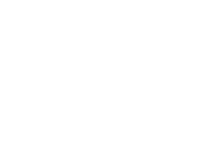

# 🌟 Sonolite - AI-Powered Handheld Ultrasound for Rural Healthcare

<p align="center">
  
</p>

## 🧠 Abstract

Access to ultrasound technology remains a significant challenge in rural healthcare settings due to high costs and a lack of trained professionals, limiting timely prenatal diagnostics. 

**Sonolite** is introduced as an **AI-powered**, **low-cost handheld ultrasound solution** tailored for rural areas. It integrates a deep learning model utilizing **R-CNN with a custom ResNet34 backbone** to detect fetal structures like the abdomen, legs, hands, and head. The app also provides **trimester-specific dietary recommendations** to support maternal health. 

The solution emphasizes cost reduction, AI assistance, and intuitive usability, making prenatal diagnostics more accessible and efficient in low-resource settings.

---

## 💡 Introduction

Sonolite aims to **revolutionize prenatal care** in underserved regions by offering a portable and affordable alternative to traditional ultrasound machines. 

### 🔑 Key Features

- 🎯 **AI-Powered Fetal Detection**  
  Automatically detects key fetal structures (abdomen, head, legs, hands) using a **Region-Based CNN with a custom ResNet34** backbone.

- 💸 **Affordability**  
  Designed to minimize hardware costs using efficient AI-based automation, enabling large-scale rural deployment.

- 📲 **Smartphone Integration**  
  Runs on mobile devices, eliminating the need for bulky ultrasound machines.

- 🥗 **Trimester-Specific Diet Guidance**  
  Personalized maternal nutrition recommendations based on trimester and health conditions.

- 🌍 **Multilingual Support**  
  Supports local languages like **Hindi**, **Tamil**, and **English** to ensure usability across diverse user bases.

- 🧑‍⚕️ **Rural-Focused UI**  
  Simplified interface designed for community health workers with minimal training requirements.

---

## 🧰 Tech Stack

| Layer | Technology |
|-------|------------|
| **Frontend** | Android (Java), XML UI Layouts |
| **Backend**  | SQLite (Local DB), Flask |
| **AI/ML**    | PyTorch, OpenCV |
| **Deep Learning Model** | R-CNN with Custom ResNet34 |
| **Model Application** |  R-CNN (for ultrasound image detection) |
| **Languages Supported** | English, Hindi, Tamil |
| **Tools** | Android Studio, VS Code, Jupiter Notebook, Kaggle for training models |


## 🧪 Dataset

- **Ultrasound Model**: Trained on [FPUS23 dataset](https://github.com/bharathprabakaran/FPUS23).
---

## 📋 How to Run

1. Clone the repository  
   ```bash
   git clone https://github.com/your-username/sonolite.git
2. Open the project in Android Studio
    - Run the app on emulator or Android device.
    - Ensure model files are correctly stored in assets or app directory.
3. Run Flask API locally.

## 🚀 Future Enhancements

- 🔌 Integration with low-cost ultrasound hardware probe.  
- ☁️ Cloud sync for remote diagnostics.  
- 📈 Medical history tracking and report generation.  


## 🙌 Acknowledgments

- Community Health Workers who shared insights.  
- Public Health Survey Participants.  
- [FPUS23 dataset](https://github.com/bharathprabakaran/FPUS23).   

---


  
  
